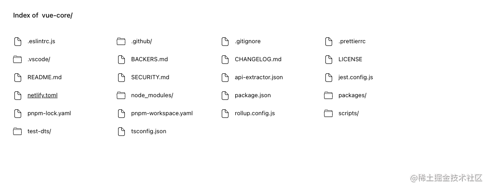
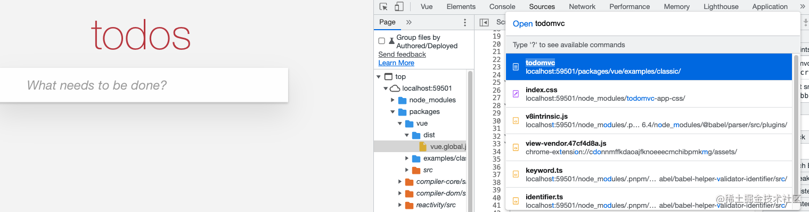
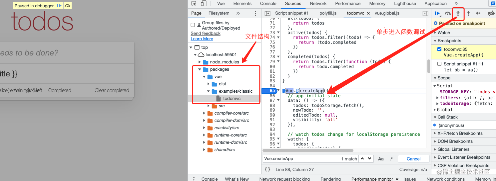
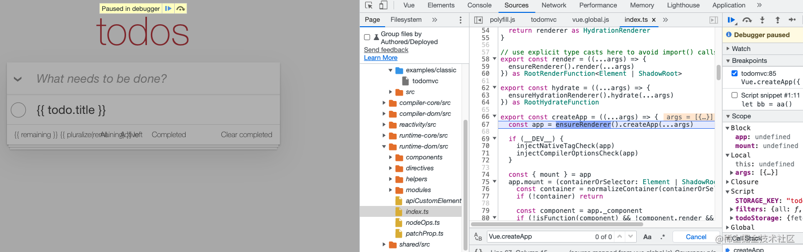

# Vue3 源码学习和调试

## 搭建源码调试环境

1. 克隆源码，下载到本地

```shell
git clone git@github.com:vuejs/core.git
```

2. 安装依赖，使用的是 [pnpm](https://www.pnpm.cn/)

```shell
cd core && pnpm install
```

3. 打包 `vue` 文件

```js
pnpm run dev
```

运行 `pnpm run dev` 创建 `packages/vue/dist` 目录，生成两个文件 `vue.global.js` 和 `vue.global.js.map`，是打包后的 vue 文件

4. 启动本地服务

`ctrl + c` 结束进程，执行 `pnpm run serve`

```shell
pnpm run serve
```

上面命令启动一个服务，默认启动一个端口，打开 `localhost`，显示项目的目录结构界面



进入界面事例，点击 `packages` =》 `vue` =》 `examples`，选择一个 `classic/todomvc`，进入 `todomvc.html`界面


也可以在 `packages/vue/example` 目录下新建一个 `html` 文件，引入 `dist/vue.global.js` 文件，安装 http 服务插件 VSCode `Live Server`，在本地启动服务打开 html 文件

1. 打开浏览器开发者工具

在 `source` 面板，快捷键 `cmd + p`，输入 todomvc，进入 todomvc 文件源码



`cmd + f` 搜索 `Vue.createApp`，在函数方法打上断点单步调试，进入 `createApp` 函数；

查看源码文件的路径结构，右键鼠标，选择 `Reveal in sidebar` 在左侧边栏打开



这时可以看到 `createApp` 函数的真面目，在 `/packages/runtime-dom/src/index.ts`



## 项目架构

开始阅读源码前，先从全局的角度对框架的设计有整体的认知，否则在阅读过程中，容易被细节困住，迷失方向。

先从目录结构开始分析，了解每个模块做哪些功能，模块与模块之间是如何划分和关联的。

Vue 3 从代码结构上进行了梳理，采用 `monorepo` 单体仓库模式管理项目代码，使用 `pnpm workspace` 方式实现。它将内部实现的部分抽象成了一个个模块放在 `packages` 下，每个 `packages` 子目录都有自己的类型声明、单元测试。 package 可以独立发布，这样设计便于维护、发版和阅读。例如我们可以单独引用 `reactivity` 这个模块，在导入这些软件包时，需要 `@vue/`前缀。

```
// 目录结构分析
├── .github              // github 工作流，issue 模版，代码贡献指南
├── .vscode              // vscode 编辑器的配置
├── packages             // vue 源码核心包，使用 pnpm workspace 工作区管理
│   ├── compiler-core    // 编译器（平台无关），例如基础的 baseCompile 编译模版文件, baseParse生成AST
│   ├── compiler-dom     // 基于compiler-core，专为浏览器的编译模块，可以看到它基于baseCompile，baseParse，重写了complie、parse
│   ├── compiler-sfc     // 编译vue单文件组件
│   ├── compiler-ssr     // 服务端渲染编译
│   ├── reactivity       // vue独立的响应式模块，可以与任何框架配合,使用proxy
│   ├── reactivity-transform  // 响应式实验功能，目前仅用于测试
│   ├── runtime-core     // 与平台无关的运行时。有虚拟DOM渲染器，vue组件和各种API。可针对某个具体平台实现高阶runtime，比如自定义渲染器
│   ├── runtime-dom      // 针对浏览器的runtime。包含处理原生DOM API
│   ├── runtime-test     // 一个专门为了测试而写的轻量级 runtime。由于这个 rumtime 「渲染」出的 DOM 树其实是一个 JS 对象，所以这个 runtime 可以用在所有 JS 环境里。你可以用它来测试渲染是否正确。
│   ├── server-renderer     // 服务端渲染
│   ├── sfc-playground
│   ├── shared             // 内部工具库,不暴露API
│   ├── size-check          // 简单应用，用来测试代码体积
│   ├── template-explorer  // 用于调试编译器输出的开发工具
│   └── vue                 // 面向公众的完整版本, 包含运行时和编译器
│   └── vue-compat          // 用于兼容 vue2
│   ├── global.d.ts      // 声明文件
├── scripts              // vue3脚本文件，包含配置文件，进行编译和打包等
│   ├── bootstrap.js
│   ├── build.js
│   ├── checkYarn.js
│   ├── dev.js
│   ├── release.js
│   ├── setupJestEnv.ts
│   ├── utils.js
│   └── verifyCommit.js
├── test-dts             // 测试文件
│   ├── README.md
│   ├── component.test-d.ts
│   ├── componentTypeExtensions.test-d.tsx
│   ├── defineComponent.test-d.tsx
│   ├── functionalComponent.test-d.tsx
│   ├── h.test-d.ts
│   ├── index.d.ts
│   ├── inject.test-d.ts
│   ├── reactivity.test-d.ts
│   ├── ref.test-d.ts
│   ├── setupHelpers.test-d.ts
│   ├── tsconfig.build.json
│   ├── tsconfig.json
│   ├── tsx.test-d.tsx
│   └── watch.test-d.ts
├── CHANGELOG.md    // 多个版本提交记录、时间和内容
├── LICENSE         // MIT协议是所有开源许可中最宽松的一个，除了必须包含许可声明外，再无任何限制。
├── README.md       // 项目说明
├── api-extractor.json   // 这是所有包的共享基本配置文件
├── jest.config.js       // 测试配置文件
├── package.json         // 项目依赖
├── rollup.config.js     // rollup打包配置文件
├── tsconfig.json        // 定了用来编译这个项目的根文件和编译选项
├── pnpm-lock.yaml       // 锁定依赖版本
└── pnpm-workspace.yaml  // pnpm 工作区
```

- `compiler-core`: 编译器（平台无关），例如基础的 `baseCompile` 编译模版文件, `baseParse` 生成 AST
- `compiler-dom`: 基于 `compiler-core`，专为浏览器的编译模块，可以看到它基于 `baseCompile`，`baseParse`，重写了 complie、parse
- `compiler-sfc`: 编译 vue 单文件组件
- `compiler-ssr`: 服务端渲染相关的
- `reactivity`: vue 独立的响应式模块
- `runtime-core`: 也是与平台无关的基础模块，有 vue 的各类 API，虚拟 dom 的渲染器
- `runtime-dom`: 针对浏览器的 runtime。包含处理原生 DOM API
- `runtime-test`：一个专门为了测试而写的轻量级 runtime。由于这个 rumtime 「渲染」出的 DOM 树其实是一个 JS 对象，所以这个 runtime 可以用在所有 JS 环境里。你可以用它来测试渲染是否正确。
- `shared`：内部工具库,不暴露 API
- `size-check`：简单应用，用来测试代码体积
- `template-explorer`：用于调试编译器输出的开发工具
- `vue` ：面向公众的完整版本, 包含运行时和编译器
- `api-extractor.json` —— 所有包共享的配置文件。当我们 src 下有多个文件时，打包后会生成多个声明文件。使用 `@microsoft/api-extractor` 这个库是为了把所有的 `.d.ts` 合成一个，并且，还是可以根据写的注释自动生成文档。
- `template-explorer`: 用于调试编译器输出的开发工具。您可以运行 npm run dev dev template-explorer 并打开它 `index.html` 以获取基于当前源代码的模板编译的副本。在线编译网址：`vue-next-template-explorer.netlify.app/#`

## Vue 源码入口

首先阅读 [官网](https://vuejs.org/guide/introduction.html#what-is-vue) 了解功能使用，Vue3 实例化应用不在采用 `new` 方式，而是使用 `createApp`

```js
import { createApp } from 'vue'

createApp({
  data() {
    return {
      count: 0
    }
  }
}).mount('#app')
```

从上面调试在 `createApp` 打上 debug，进入这个函数，函数位置在文件 [packages/runtime-dom/src/index.ts](https://github.com/vuejs/core/blob/main/packages/runtime-dom/src/index.ts#L66-L112)

```js
export const createApp = ((...args) => {
  const app = ensureRenderer().createApp(...args)

  if (__DEV__) {
    injectNativeTagCheck(app)
    injectCompilerOptionsCheck(app)
  }

  const { mount } = app
  app.mount = (containerOrSelector: Element | ShadowRoot | string): any => {
    const container = normalizeContainer(containerOrSelector)
    if (!container) return

    const component = app._component
    if (!isFunction(component) && !component.render && !component.template) {
      if (__COMPAT__ && __DEV__) {
        for (let i = 0; i < container.attributes.length; i++) {
          const attr = container.attributes[i]
          if (attr.name !== 'v-cloak' && /^(v-|:|@)/.test(attr.name)) {
            compatUtils.warnDeprecation(
              DeprecationTypes.GLOBAL_MOUNT_CONTAINER,
              null
            )
            break
          }
        }
      }
    }

    // clear content before mounting
    container.innerHTML = ''
    const proxy = mount(container, false, container instanceof SVGElement)
    if (container instanceof Element) {
      container.removeAttribute('v-cloak')
      container.setAttribute('data-v-app', '')
    }
    return proxy
  }

  return app
}) as CreateAppFunction<Element>
```

上面代码 `createApp` 创建应用时调用的方法实现流程

- `ensureRenderer` 是一个单例模式的函数，会返回一个 `renderer`，如果无 `renderer` 则会调用`createRenderer` 进行获取 `renderer` ，获得了一个 `app` 实例；
- dev 环境下注册一个方法：`isNativeTag`，挂载到 `app.config` 下面；
- 获取到实例的 `mount` 方法，并保存下来；
- 重写实例的 `mount` 方法；
  - 调用 `normalizeContainer` 获取根元素容器；
  - 判断 `template`，获取需要渲染的模板；
  - 把容器的 `innerHTML` 置空；
  - 调用上面实例的 `mount` 方法；
  - 删除 `v-cloak` 属性，添加 `data-v-app` 属性；
- 返回 mount 后的代理；

从上面来看，createApp 主要做的事是调用 `ensureRenderer().createApp(...args)
` 创建一个 `app` 实例，然后重写 `mount` 方法挂载，返回这个实例，整个实例化和挂载的流程很清晰，细节在后面深入研究分析。

其次，当代码逻辑比较复杂难读懂的时候，可以从测试用例入手。比如某个方法使用在官网上描述不是很清晰，想知道的更多些，比起直接深入到源码中，测试用例是一个相对快捷省时的方式。

测试文件后缀是 `spec`，例如 `createApp` 测试文件[createApp.spec.ts](https://github.com/vuejs/core/blob/main/packages/runtime-dom/__tests__/createApp.spec.ts) ，有两条测试用例

- 可以挂载到 `svg` 元素上
- 不应该改变原来的根组件选项对象

而且也给出对应修复的 `issue`，还可以去到 issue 上了解这个功能的背景

```js
describe('createApp for dom', () => {
  // #2926
  test('mount to SVG container', () => {
    const root = document.createElementNS('http://www.w3.org/2000/svg', 'svg')
    createApp({
      render() {
        return h('g')
      }
    }).mount(root)
    expect(root.children.length).toBe(1)
    expect(root.children[0] instanceof SVGElement).toBe(true)
  })

  // #4398
  test('should not mutate original root component options object', () => {
    const originalObj = {
      data() {
        return {
          counter: 0
        }
      }
    }

    const handler = jest.fn((msg) => {
      expect(msg).toMatch(`Component is missing template or render function`)
    })

    const Root = { ...originalObj }

    const app = createApp(Root)
    app.config.warnHandler = handler
    app.mount(document.createElement('div'))

    // ensure mount is based on a copy of Root object rather than Root object itself
    expect(app._component).not.toBe(Root)

    // ensure no mutation happened to Root object
    expect(originalObj).toMatchObject(Root)
  })
})
```

## 总结思考

阅读源码，选择一个合适的工具让代码先跑起来，能够在源码上调试，然后理清楚代码组织关系及用途，单点突破，带着问题和目的去阅读，利用好单元测试。同时也要权衡利弊，该跳就跳，长期处于蒙的状态很容易走进死胡同，可以标记回头再看；利用搜索引擎，结合网上的源码分析资料理解。
