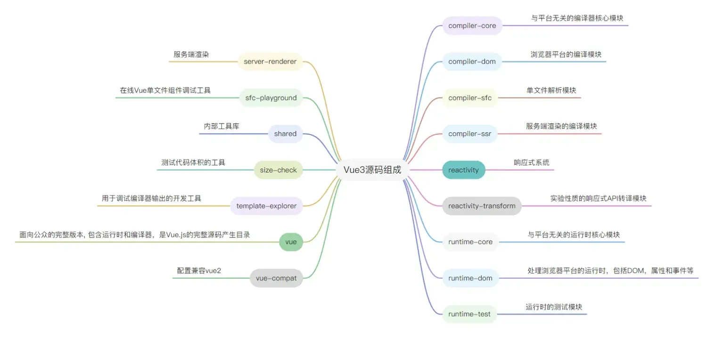

## Vue3 目录结构

```
core
├── packages             // vue 源码核心包，使用 pnpm workspace 工作区管理
│   ├── compiler-core
│   ├── compiler-dom
│   ├── compiler-sfc
│   ├── compiler-ssr
│   ├── reactivity
│   ├── reactivity-transform
│   ├── runtime-core
│   ├── runtime-dom
│   ├── runtime-test
│   ├── server-renderer
│   ├── sfc-playground
│   ├── shared
│   ├── size-check
│   ├── template-explorer
│   └── vue
│   └── vue-compat
```

包功能模块介绍：

- `compiler-core` 编译器（平台无关）: 编译器的基础编译流程：解析模版生成 AST - AST 的节点转换 - 根据 AST 生成代码。在 AST 的节点转换过程中，会执行很多转换插件，compiler-core 则包含所有与平台无关的转换插件。
- `compiler-dom`: 基于 `compiler-core`，专为浏览器的编译模块，基于 `baseCompile`，`baseParse`，重写了 complie、parse
- `compiler-sfc`: 编译 vue 单文件组件，相关 template、script、style 解析相关的代码
- `compiler-ssr`: 服务端渲染编译器，它也是在 compiler-core 基础上进行封装，也依赖了 compiler-dom 提供了一部分辅助转换函数。它包含了专门针对服务端渲染的转换插件
- `reactivity`: vue 独立的响应式模块
- `runtime-core`: 与平台无关的基础模块，有 vue 的各类 API，虚拟 dom 的渲染器，组件实现、和一些全局 API，可以基于它实现特定平台的高阶运行时（自定义渲染器）
- `runtime-dom`: 针对浏览器的 runtime。包含处理原生 DOM API 、属性、样式、事件等处理
- `runtime-test`：一个专门为了测试而写的轻量级 runtime。由于这个 rumtime 「渲染」出的 DOM 树其实是一个 JS 对象，所以这个 runtime 可以用在所有 JS 环境里。你可以用它来测试渲染是否正确。
- `shared`：内部工具库,不暴露 API
- `size-check`：简单应用，用来测试代码体积
- `template-explorer`：用于调试编译器输出的开发工具
- `vue` ：面向公众的完整版本, 包含运行时和编译器
- `api-extractor.json` —— 所有包共享的配置文件。当我们 src 下有多个文件时，打包后会生成多个声明文件。使用 `@microsoft/api-extractor` 这个库是为了把所有的 `.d.ts` 合成一个，并且，还是可以根据写的注释自动生成文档。
- `template-explorer`: 用于调试编译器输出的开发工具。您可以运行 npm run dev-compiler，然后执行 npm run open 打开模版编译输出工具，调试编译结果。在线编译网址：`vue-next-template-explorer.netlify.app/#`


