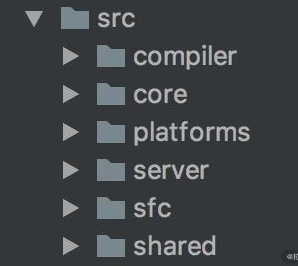

# Vue3 做了哪些优化和变化

Vue3 从源码、性能和语法 API 层面做了优化

## 源码优化

### 架构优化：monorepo 代码管理策略

Vue2 的源码放在 src 目录，然后依据功能拆分出了 compiler（模板编译的相关代码）、core（与平台无关的通用运行时代码）、platforms（平台专有代码）、server（服务端渲染的相关代码）、sfc（.vue 单文件解析相关代码）、shared（共享工具代码） 等目录

这些目录不能拆分，深度耦合。



在 Vue.js 3.0 ，整个源码是通过 monorepo 的方式维护，根据功能将不同的模块拆分到 packages 目录下，分为 reactivity（响应式）系统、runtime（运行时）系统和 complier（编译器）系统三大模块，runtime（运行时）系统和 complier（编译器）系统模块又分平台 API 和核心 API，


monorepo 把这些模块拆分到不同的 package 中，每个 package 有各自的 API、类型定义和测试。这样使得模块拆分更细化，职责划分更明确，模块之间的依赖关系也更加明显，开发人员也更容易阅读、理解和更改所有模块源码，提高代码的可维护性。

另外一些 package（比如 reactivity 响应式库）是可以独立于 Vue.js 使用的，这样用户如果只想使用 Vue.js 3.0 的响应式能力，可以单独依赖这个响应式库而不用去依赖整个 Vue.js，减小了引用包的体积大小

### TypeScript 类型支持

TypeScript 提供了更好的类型检查，能支持复杂的类型推导；由于源码就使用 TypeScript 编写，也省去了单独维护 d.ts 文件的麻烦；就整个 TypeScript 的生态来看，TypeScript 团队也是越做越好，TypeScript 本身保持着一定频率的迭代和更新，支持的 feature 也越来越多。

## 性能优化

### 源码体积优化

Vue3 引入 ES6 tree-shaking 的技术，减少打包体积。原理很简单，tree-shaking 依赖 ES2015 模块语法的静态结构（即 import 和 export），通过编译阶段的静态分析，找到没有引入的模块并打上标记。

在压缩阶段利用 terser 等压缩工具删除这些没有用到的代码。

### 数据劫持优化

在 Vue2 数据响应式使用 `Object.defineProperty` 的 getter 和 setter 方法劫持，如果对象嵌套太深，就需要深度递归遍历这个对象，这会带来相当大的性能负担。

为了解决这个问题，Vue3 使用了 Proxy API 做数据劫持

Vue3 采用的 `Proxy` 默认为浅代理，在初始化响应式数据时，不进行深层次代理，将递归代理深层次属性的过程放在 getter 阶段，从而带来更好的性能提升。

```js
observed = new Proxy(data, {
  get() {
    // track
  },
  set() {
    // trigger
  }
})
```

### 编译优化

Vue.js3 通过编译阶段对静态模板的分析，编译生成了 Block tree。Block tree 是一个将模版基于动态节点指令切割的嵌套区块，每个区块内部的节点结构是固定的，而且每个区块只需要以一个 Array 来追踪自身包含的动态节点。借助 Block tree，Vue.js 将 vnode 更新性能由与模版整体大小相关提升为与动态内容的数量相关，这是一个非常大的性能突破

除此之外，Vue.js 3.0 在编译阶段还包含了对 Slot 的编译优化、事件侦听函数的缓存优化，并且在运行时重写了 diff 算法

### Virtual DOM 变化

Vue3 对 Virtual DOM 进行重构，在 diff 过程中采用新的优化策略：将优化提前到编译阶段，通过 patchFlag 等标识，为运行阶段提供更多有效信息；新增 block 概念，以最小静态块提取动态内容，达到点对点直接对比，避免不必要的遍历。这些针对细节的优化，能够减少 diff 阶段消耗的时间和空间，带来更好的性能提升。

## 语法 Composition API 优化

### 优化逻辑组织

在 Vue2 Options API 的设计是按照 methods、computed、data、props 这些不同的选项分类，当组件小的时候，这种分类方式一目了然；但是在大型组件中，一个组件可能有多个逻辑关注点，当使用 Options API 的时候，每一个关注点都有自己的 Options，如果需要修改一个逻辑点关注点，就需要在单个文件中不断上下切换和寻找。

为了解决这个问题，Vue3 设计令 Composition API，它的设计灵感来源于 React hooks，将逻辑关注点相关的代码全都放在一个函数里，这样当需要修改一个功能时，就不再需要在文件中跳来跳去。

composition API：可以根据逻辑功能组织代码，将同一个功能相关的 API 放在一起，通过函数的方式进行暴露和使用，一定程度上可不受位置的影响（组合式 API）。

### 优化逻辑复用

当我们开发项目变得复杂的时候，免不了需要抽象出一些复用的逻辑。在 Vue.js 2.x 中，我们通常会用 mixins 去复用逻辑，举一个鼠标位置侦听的例子，我们会编写如下函数 mousePositionMixin：

```js
const mousePositionMixin = {
  data() {
    return {
      x: 0,
      y: 0
    }
  },
  mounted() {
    window.addEventListener('mousemove', this.update)
  },
  destroyed() {
    window.removeEventListener('mousemove', this.update)
  },
  methods: {
    update(e) {
      this.x = e.pageX
      this.y = e.pageY
    }
  }
}
export default mousePositionMixin
```

但一个组件混入大量不同的 mixins 的时候，会存在两个非常明显的问题：命名冲突和数据来源不清晰。

因为每个 mixin 都可以定义自己的 props、data，它们之间是无感的，所以很容易定义相同的变量，导致命名冲突。另外对组件而言，如果模板中使用不在当前组件中定义的变量，那么就会不太容易知道这些变量在哪里定义的，这就是数据来源不清晰

用 Vue3 composition 优化

```js
import { ref, onMounted, onUnmounted } from 'vue'

export default function useMousePosition() {
  const x = ref(0)
  const y = ref(0)
  const update = (e) => {
    x.value = e.pageX
    y.value = e.pageY
  }
  onMounted(() => {
    window.addEventListener('mousemove', update)
  })
  onUnmounted(() => {
    window.removeEventListener('mousemove', update)
  })
  return { x, y }
}
```

可以看到，整个数据来源清晰了，即使去编写更多的 hook 函数，也不会出现命名冲突的问题。

Composition API 除了在逻辑复用方面有优势，也会有更好的类型支持，因为它们都是一些函数，在调用函数时，自然所有的类型就被推导出来了，不像 Options API 所有的东西使用 this。另外，Composition API 对 tree-shaking 友好，代码也更容易压缩。
