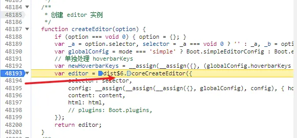
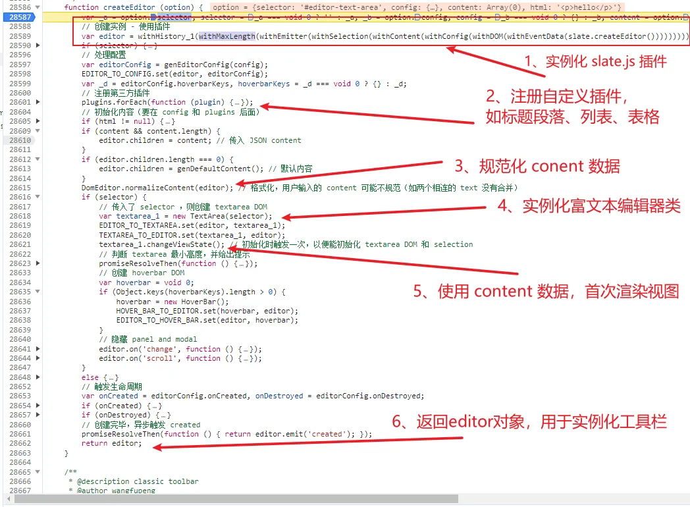

# 阅读调试及分析 wandEditor 开源项目

## 前言

开发富文本编辑器， [wangEditor](https://github.com/wangeditor-team/wangEditor) 是一个比较好的借鉴项目，通过阅读 wangEditor 源码深入理解富文本编辑器的实现原理、设计思想和技术选型。

例如

- 为了减少造轮子，实现富文本复杂的功能，引入 `slate.js` 框架
- 为了摆脱框架的依赖，使用 `snabbdom` 实现 `slate-react` 视图层，同时 diff 更新提升性能
- 为了项目的扩展性和维护性，使用 lerna 做代码管理，将视频、表格复杂的功能模块拆分到子包
- 设计插件机制，扩展富文本的功能，满足定制化功能

阅读源码更重要的是，在开发产品需求，发现开源项目有 bug，作者来不及修复，需要更改源码，这时可以 fork 一份代码下来，进行二次开发，实现产品的定制化需求

## 准备工作

克隆项目

```js
git clone https://github.com/wangeditor-team/wangEditor
```

阅读项目的 [开发文档](https://github.com/wangeditor-team/wangEditor/blob/master/docs/dev.md)

1.  进入 wangEditor 目录
2.  安装所有依赖 `yarn bootstrap`
3.  打包所有模块 `yarn dev` 或者 `yarn build`，为了方便调试运行前者

注：在我 Mac 电脑 node 运行版本 `16.10.0`

**运行 demo**

进入 `packages/editor` 目录，运行 `yarn example` ，浏览器打开 `http://localhost:8881/examples/`，看到下面的目录界面，我选择 simple-mode 路径，可以编辑查看修改后的数据结构

| example 目录界面        | simple-mode 页面        |
| ----------------------- | ----------------------- |
|  |  |

## 源码调试

### 入口文件

在 `simple-mode` html 文件 `createEditor` 方法上面打上 `debugger` 断点，打开浏览器控制台，刷新界面，出现下面的调试界面

文件路径 packages/editor/examples/simple-mode.html


那么如何调试进入 createEditor 方法呢，我常用的一个调试技巧是：

**将鼠标悬浮在 createEditor 方法上，出现一个提示框，点击 FunctionLocation 文件路径，可以跳转到对应源码的文件位置**


定位到 `createEditor` 方法位置，接着在 `coreCreateEditor` 方法打上断点，继续执行



同样根据上面的步骤，定位到 coreCreateEditor 源码位置，在方法执行前打上断点

从下面可以看到 coreCreateEditor 方法是实例化富文本的执行函数，主要做的事情：



1、调用 slate.js `createEditor` 方法创建 editor 对象，wangEditor 基于它提供的插件机制，封装了多个插件，类似 koa 洋葱模型

它的插件机制也很容易理解，就是往 editor 对象上添加方法，或者重写对象方法，有点类似 Vue mount 方法实现

```js
export const withContent = (editor) => {
  const e = editor
  const { insertText } = e

  e.insertText = (text: string) => {
    const { readOnly } = e.getConfig()
    if (readOnly) return

    insertText(text)
  }
  //...
  return e
}
```

插件介绍

- withMaxLength ：处理编辑文本内容长度计算
- withEmitter ：注册自定义事件，数据通信方案 on/once/off/emit
- withSelection：选中/取消选中节点、光标等处理
- withContent ：编辑内容的处理
- withConfig：富文本的配置方法封装
- withDOM：DOM 操作方法的封装
- withEventData：事件数据的处理

2、注册第三方插件

`register-builtin-modules/index` 进行插件批量注册，遍历 `plugins` 数组，实际是根据插件形式实现 段落、标题、列表、表格等功能，往 edior 对象添加函数


3、htmlToContent 将传入的 html 转换为 editor.children，传入 content 的优先级高

接着 normalizeContent 方法规范化 content 数据，如两个相连的 text 合并，减少重复节点


4、最后实例化 TextArea ，调用 changeViewState 更新视图内容，渲染的步骤可以阅读[基于 slate.js 框架 wangEditor 富文本渲染及源码分析](https://juejin.cn/post/7324528599779835930#heading-3)这篇文章

## 加粗标记调试

富文本加粗按钮，第一次点击加粗，第二次点击取消加粗，加粗标记实现流程

1.  鼠标选中文本，触发 `selectionchange` 事件，将 DOM selection 同步给 `slate.section`，此时 slate.js 知道选中的文本起始点和终点的范围
2.  点击工具栏加粗按钮，使用 slate.js API 加粗文本


### selectionchange 选区

搜索 `selectionchange` 方法，在 onDOMSelectionChange 打上断点

执行 `DOMSelectionToEditor` 方法，将 `DOM selection` 转化为 slate range 选择范围，调用

`Transforms.select` 选中范围，此时 `editor.section` 保存了 range 最新的值


editor.section 是 slate 的选区，包含 `anchor 起始点` 和 `focus 终点`，在 slate 用 Point 表示，它又由 Path 和 offset 组成

例如下面

- anchor: path 路径 \[0, 0] 表示第一行第一列，offst 偏移是 3，是在 `hello` 的 `l` 起点
- focus： path 路径 \[1, 0] 表示第二行第一列，offset 偏移是 5，是在 `world` 的 `d` 终点


### 加粗按钮

搜索 `addMark`，在 `BaseMenu.prototype.exec` 打上断点

执行 `editor.addMark` 添加 bold 标记


addMark 加粗标记，内部会调用 `Transforms.setNodes` 设置节点，`split` 参数会根据 `match` 匹配函数进行切割文本


不妨继续进入 `slate.js` 源码看下 Transforms.setNodes 函数的执行，它内部会在 focus 和 anchor 节点位置，分别调用 `Transforms.splitNodes` 方法进行切割文本


最后通过调用 `editor.apply` 方法，在给 `[0, 1]` 节点设置了 bold 属性，添加标记过程就算完成了

```js
editor.apply({
  type: 'set_node',
  path: [0, 1],
  properties: properties,
  newProperties: { bold: true }
})
```


wangEditor 是以数据为驱动渲染页面，在更改 editor.children 数据后，会重新渲染

那怎么触发重新渲染？

### 重新渲染

可以在 `changeViewState` 方法上打上断点，通过函数执行栈找到触发的事件，可以看到执行 apply 方法后，调用了 `editor.onChange` 方法


onChange 通过事件派发，执行 changeViewState 重新渲染

```js
// editor onchange 时更新视图
editor.on('change', this.changeViewState.bind(this))
```


## 疑问

有没有疑问，富文本编辑是使用 div 属性 `contenteditable` 键盘输入，既然实现了数据驱动渲染，那会不会和 键盘输入的内容产生冲突 ？

通过阅读源码才知道，有个 `beforeinput` 事件，`event.preventDefault` 劫持所有的富文本输入


输入的内容，使用 slate.js `Editor.insertText` API 插入文本，这样就实现了直接修改数据后渲染

```JS

const data = event.dataTransfer || event.data || undefined

Editor.insertText(editor, data)

```
