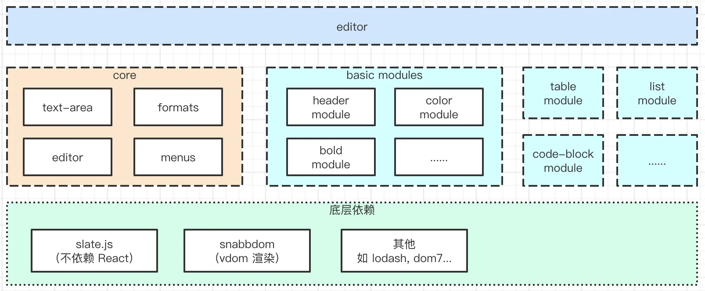
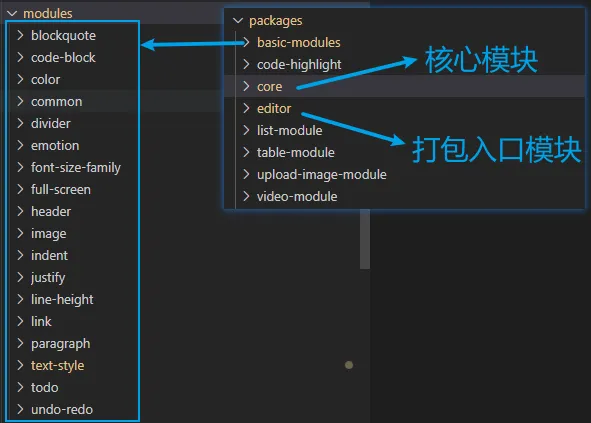
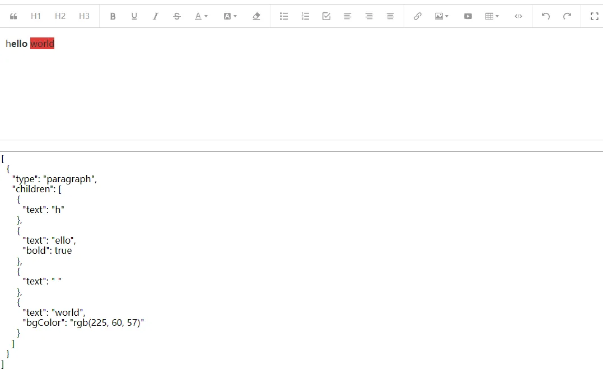
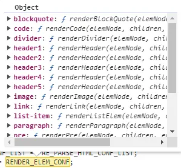
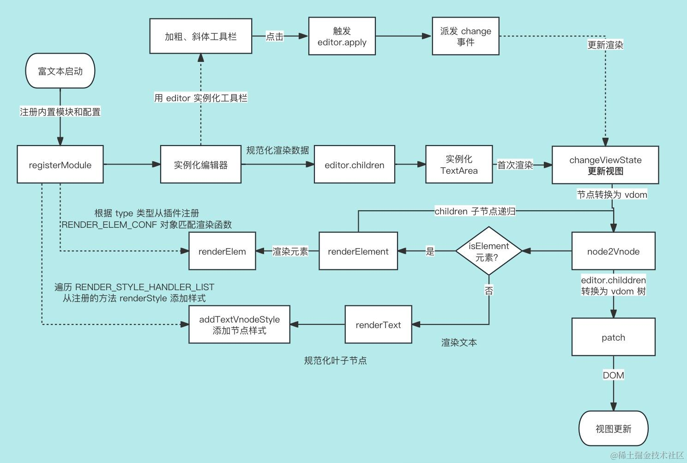

# wandEditor 富文本源码分析

## 概述

使用 [editorjs](https://editorjs.io/) 开发富文本编辑器，发现行内工具如加粗、斜体、删除线、颜色背景等操作要自己实现，现成的 `document.execCommand` API 有各种限制和体验问题，官方也说了有可能会废除（历史原因不能这么干）

调研了市面上的产品，[slate.js](https://github.com/ianstormtaylor/slate) 框架能实现工具栏的功能，做到与框架无关，不过要进行大量的二次开发，封装复杂，而 [wangEditor](https://www.wangeditor.com) 正好是基于 slate.js 实现，于是分析 wangEditor 源码实现，方便将 slate.js 集成到 editor.js ，记录了 wangEditor 渲染流程。

## 架构分析

wangEditor 使用 lerna 进行代码管理，底层依赖 `slate.js` 和 `snabbdom` 库实现

1.  slate.js 库负责对文本、节点内容处理，如文本操作（字体加粗、下划线、删除线、颜色、背景等）、元素操作（插入段落、标题、列表、表格、图片等）
2.  wangEditor 没有使用 `slate-react` 渲染 ，它与框架无关，可以使用在 Vue、React 项目，渲染使用 snabbdom，利用 patch diff 提升更新的性能



wangEditor 代码拆分到 packages 子模块下，方便扩展和维护

1.  `core` 是核心模块，包含了 TextArea 类，编辑器 editor 操作方法 、文本格式 formats、菜单操作 menus，是编辑器的核心逻辑
2.  `editor` 模块是打包的入口模块，项目引入使用 `@wangeditor/editor` 包也是这个模块，它在入口文件，将 basic-modules（段落、标题模块等集合）、代码高亮、列表、表格、 图片、视频这些分散的模块进行批量注册，使用 Boot 静态类进行统一管理，在编辑器实例化，将 `Boot.plugins` 插件传入 `core` 包注册使用

总的来说，`editor` 模块相当于出口，作为中间桥梁，将核心包 core 和其他功能模块的包很好的集成在一起，既方便代码管理，也能通过插件机制，很好的扩展其他功能模块。



## 开始使用

wangEditor 富文本将 **编辑内容区域** 和 **工具栏** 分成两步使用

- 第一步：`createEditor` 方法创建 editor 编辑器实例对象， 同时渲染编辑器内容数据
- 第二步：`createToolbar` 方法传入 editor 对象，实例化编辑器工具栏，调用 editor 对象的方法可以对文本进行加粗、斜体、删除线等操作

这样设计的好处，可以实现工具栏定制化，可有可无，满足更多的业务场景。同时通过 editor 对象保持工具栏和编辑器的数据同步和一致性

```JS
import { createEditor, createToolbar } from '@wangeditor/editor'

// editor 配置
const editorConfig = {}

const editor = createEditor({
  selector: '#editor-text-area',
  config: editorConfig,
  html: '<p>hello</p>',
  mode: 'simple'
})

const toolbar = createToolbar({
  editor,
  selector: '#editor-toolbar',
  config: {},
  mode: 'simple'
})
```

编辑器的页面渲染，是以数据驱动，数据存储到 `editor.children`



## 富文本渲染流程

### 注册内置模块

在入口文件，自动注册内置模块，将 basic-modules、list-module 等分散的模块进行批量注册

```JS
// packages/editor/src/index.ts

import './register-builtin-modules/index'
```

引入文件后，自动执行

```js
// register-builtin-modules/index
import basicModules from '@wangeditor/basic-modules'
import wangEditorListModule from '@wangeditor/list-module'
import wangEditorTableModule from '@wangeditor/table-module'
import wangEditorVideoModule from '@wangeditor/video-module'
import wangEditorUploadImageModule from '@wangeditor/upload-image-module'
import { wangEditorCodeHighlightModule } from '@wangeditor/code-highlight'

import registerModule from './register'

basicModules.forEach((module) => registerModule(module))
registerModule(wangEditorListModule)
registerModule(wangEditorTableModule)
registerModule(wangEditorVideoModule)
registerModule(wangEditorUploadImageModule)
registerModule(wangEditorCodeHighlightModule)
```

调用 registerModule 注册函数，将模块数据添加到静态类 `Boot`

### 富文本实例化

执行函数 `coreCreateEditor`，内部调用 `slate.js` 框架的 `createEditor` 实例化编辑器，并返回 editor 对象

```JS
/**
 * 创建 editor 实例
 */
export function createEditor() {

  const editor = coreCreateEditor({
    selector,
    config: {
      ...globalConfig, // 全局配置
      ...config,
      hoverbarKeys: newHoverbarKeys,
    },
    content,
    html,
    plugins: Boot.plugins,
  })

  return editor
}
```

`coreCreateEditor` 执行操作

- 调用 slate.js 库 `createEditor()` 函数实例化编辑器，并基于它提供的插件机制，做了很多扩展，类似洋葱模型
- 将传入 `html` 转换为 json，存入 `editor.children` 数据渲染，`content` 字段优先级比 `html` 高
- 实例化 `TextArea`，调用 `textarea.changeViewState` 渲染视图

```js
// packages/core/src/create/create-editor.ts

export default function coreCreateEditor (option) {
  const { selector = '', config = {}, content, html, plugins = [] } = option

  // 创建实例 - 使用插件
  let editor = withHistory(
    withMaxLength(
      withEmitter(withSelection(withContent(withConfig(withDOM(withEventData(createEditor()))))))
    )
  )
  if (selector) {
  // 处理配置
  const editorConfig = genEditorConfig(config)

  // 注册第三方插件
  plugins.forEach(plugin => {
    editor = plugin(editor)
  })

  // 初始化内容（要在 config 和 plugins 后面）
  if (html != null) {
    // 传入 html ，转换为 JSON content
    editor.children = htmlToContent(editor, html)
  }
  if (content && content.length) {
    editor.children = content // 传入 JSON content
  }
  if (editor.children.length === 0) {
    editor.children = genDefaultContent() // 默认内容
  }
  DomEditor.normalizeContent(editor) // 格式化，用户输入的 content 可能不规范（如两个相连的 text 没有合并）

  if (selector) {
    // 传入了 selector ，则创建 textarea DOM
    const textarea = new TextArea(selector)
    // 视图更新
    textarea.changeViewState() // 初始化时触发一次，以便能初始化 textarea DOM 和 selection

  return editor
}
```

批量注册的插件，遍历 `plugins` 数组函数，传入 editor 挂载或重写 编辑器实例对象方法

### 渲染视图

`changeViewState` 调用 updateView 方法，使用 `editor.children` 数据渲染富文本内容

注：`editorSelectionToDOM` 方法是在工具栏操作如加粗，它是数据驱动，修改了 `editor.children` 数据结构，派发 change 事件 changeViewState 重新渲染了，要处理 `editor.section` 新的选中范围 `range`

```JS
// packages/core/src/text-area/TextArea.ts

changeViewState() {
  const editor = this.editorInstance

  // 更新 DOM
  // TODO 注意这里是否会有性能瓶颈？因为每次键盘输入，都会触发这里 —— 可单独测试大文件、多内容，如几万个字
  updateView(this, editor)

  // 处理 placeholder
  handlePlaceholder(this, editor)

  // 同步选区（异步，否则拿不到 DOM 渲染结果，vdom）
  promiseResolveThen(() => {
    editorSelectionToDOM(this, editor)
  })
}
```

`updateView` 方法更新视图

- 节点转化 vdom：通过遍历 `editor.children`，调用 `node2Vnode` 将数据转换为 vdom 虚拟 DOM，children 深层递归处理
- 首次渲染，创建编辑区域 dom 添加到页面，使用 patchFn 函数将 vdom 更新上去，存储 patch 函数减少初始化
- 当重新渲染，取出缓存的 patch 和 旧的 vdom，使用 diff 进行更新

```JS
// 文件路径 packages/core/src/text-area/update-view.ts

/**
 * 获取 editor.children 渲染 DOM
 * @param textarea textarea
 * @param editor editor
 */
function updateView(textarea: TextArea, editor: IDomEditor) {
  const $scroll = textarea.$scroll
  const elemId = genElemId(textarea.id)

  // 生成 newVnode
  const newVnode = genRootVnode(elemId, readOnly)
  const content = editor.children || []
  newVnode.children = content.map((node, i) => {
    let vnode = node2Vnode(node, i, editor, editor)
    normalizeVnodeData(vnode) // 整理 vnode.data 以符合 snabbdom 的要求
    return vnode
  })

  let textareaElem
  let isFirstPatch = IS_FIRST_PATCH.get(textarea)
  if (isFirstPatch == null) isFirstPatch = true // 尚未赋值，也是第一次
  if (isFirstPatch) {
    // 第一次 patch ，先生成 elem
    const $textArea = genRootElem(elemId, readOnly)
    $scroll.append($textArea)
    textarea.$textArea = $textArea // 存储下编辑区域的 DOM 节点
    textareaElem = $textArea[0]

    // 再生成 patch 函数，并执行
    const patchFn = genPatchFn()
    patchFn(textareaElem, newVnode)

    // 存储相关信息
    IS_FIRST_PATCH.set(textarea, false) // 不再是第一次 patch
    TEXTAREA_TO_PATCH_FN.set(textarea, patchFn) // 存储 patch 函数
  } else {
    // 不是第一次 patch
    const curVnode = TEXTAREA_TO_VNODE.get(textarea)
    const patchFn = TEXTAREA_TO_PATCH_FN.get(textarea)
    if (curVnode == null || patchFn == null) return
    textareaElem = curVnode.elm

    patchFn(curVnode, newVnode)
  }
  //...
}
```

`node2Vnode` 方法将对象转换为 vnode，区分元素和文本，renderElement 负责元素渲染，renderText 负责文本渲染

```JS
// packages/core/src/render/node2Vnode.ts
/**
 * 根据 slate node 生成 snabbdom vnode
 */
export function node2Vnode(node, index, parent, editor) {
  let vnode: VNode
  if (Element.isElement(node)) {
    // element
    vnode = renderElement(node, editor)
  } else {
    // text
    vnode = renderText(node, parent, editor)
  }

  return vnode
}
```

**元素渲染 renderElement**

以段落为例，段落数据结构如下

```js
const paragraph = {
  type: 'paragraph',
  children: [{ text: '段落中的一行文本。' }]
}
```

getRenderElem 根据 type 类型获取对应段落渲染函数，段落的 children 使用 node2Vnode 递归处理，样式使用 renderStyle 处理

```JS
function renderElement(elemNode, editor): VNode {
  //...
  // 根据 type 生成 vnode 的函数
  const { type, children = [] } = elemNode
  let renderElem = getRenderElem(type)

  childrenVnode = children.map((child: Node, index: number) => {
    return node2Vnode(child, index, elemNode, editor)
  })

  // 创建 vnode
  let vnode = renderElem(elemNode, childrenVnode, editor)

  // 添加文本相关的样式，如 text-align
  if (!isVoid && !isInline) {
    // 非 void + 非 inline
    vnode = renderStyle(elemNode, vnode)
  }
  return vnode
}
```

在模块注册的时候，使用 registerRenderElemConf 添加到 RENDER_ELEM_CONF 对象上，getRenderElem 根据 type 获取

```JS
function getRenderElem(type: string): RenderElemFnType {
  const fn = RENDER_ELEM_CONF[type]
  return fn || defaultRender
}
```



段落渲染函数

```js
// packages/basic-modules/src/modules/paragraph/render-elem.tsx

function renderParagraph(
  elemNode: SlateElement,
  children: VNode[] | null,
  editor: IDomEditor
): VNode {
  const vnode = <p>{children}</p>
  return vnode
}

export const renderParagraphConf = {
  type: 'paragraph',
  renderElem: renderParagraph
}
```

**文本渲染 renderText**

renderText 处理文本节点，主要是样式的处理，例如加粗、下划线、删除线，addTextVnodeStyle 实现

```JS
function renderText(textNode: SlateText, parent: Ancestor, editor: IDomEditor): VNode {
  //...
  // 根据 decorate 将 text 拆分为多个叶子节点 text[]
  const { decorate } = editor.getConfig()
  if (decorate == null) throw new Error(`Can not get config.decorate`)
  const path = DomEditor.findPath(editor, textNode)
  const ds = decorate([textNode, path])
  const leaves = SlateText.decorations(textNode, ds)

  // 生成 leaves vnode
  const leavesVnode = leaves.map((leafNode, index) => {
    // 文字和样式
    const isLast = index === leaves.length - 1
    let strVnode = genTextVnode(leafNode, isLast, textNode, parent, editor)
    strVnode = addTextVnodeStyle(leafNode, strVnode)
    // 生成每一个 leaf 节点
    return <span data-slate-leaf>{strVnode}</span>
  })

  // 生成 text vnode
  const textId = genTextId(key.id)
  const vnode = (
    <span data-slate-node="text" id={textId} key={key.id}>
      {leavesVnode /* 一个 text 可能包含多个 leaf */}
    </span>
  )

  return vnode
}
```

addTextVnodeStyle 会从注册的 RENDER_STYLE_HANDLER_LIST 样式数组中遍历，如果节点中有设置了样式属性，则添加该样式

```JS
/**
 * 给字符串增加样式
 * @param leafNode slate text leaf node
 * @param textVnode textVnode
 */
function addTextVnodeStyle(leafNode: SlateText, textVnode: VNode): VNode {
  let newTextVnode = textVnode

  RENDER_STYLE_HANDLER_LIST.forEach(styleHandler => {
    newTextVnode = styleHandler(leafNode, newTextVnode)
  })

  return newTextVnode
}
```

插件注册样式 registerStyleHandler 函数，在 `Boot.registerRenderStyle` 方法调用

```JS
/**
 * 注册处理文本样式的函数
 * @param fn 处理文本样式的函数
 */
export function registerStyleHandler(fn: RenderStyleFnType) {
  RENDER_STYLE_HANDLER_LIST.push(fn)
}
```

以文本处理 `text-style` 为例，根据节点是否有设置样式属性，使用标签包裹文本

```JS
// packages/basic-modules/src/modules/text-style/render-style.tsx
/**
 * 添加样式
 * @param node slate text
 * @param vnode vnode
 * @returns vnode
 */
export function renderStyle(node: Descendant, vnode: VNode): VNode {
  const { bold, italic, underline, code, through, sub, sup } = node as StyledText
  let styleVnode: VNode = vnode

  // color bgColor 在另外的菜单

  if (bold) {
    styleVnode = <strong>{styleVnode}</strong>
  }
  if (code) {
    styleVnode = <code>{styleVnode}</code>
  }
  if (italic) {
    styleVnode = <em>{styleVnode}</em>
  }
  if (underline) {
    styleVnode = <u>{styleVnode}</u>
  }
  if (through) {
    styleVnode = <s>{styleVnode}</s>
  }
  if (sub) {
    styleVnode = <sub>{styleVnode}</sub>
  }
  if (sup) {
    styleVnode = <sup>{styleVnode}</sup>
  }

  return styleVnode
}
```

## 渲染的流程图


